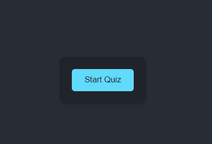

# JavaScript Quiz Application

## Description
This application provides a timed quiz on JavaScript fundamentals. Users can answer questions and save their high scores to compete with others.

## Features
- Dynamic questions generated from an array.
- Timed quiz with penalties for incorrect answers.
- High scores saved to local storage.

## Usage
To use the JavaScript Quiz Application:

1. Open the application.
2. Click the "Start" button to begin the quiz.
3. Answer the questions presented within the time limit. Note that incorrect answers will result in a time penalty.
4. Once the quiz is complete, you will have the option to save your score. Input your initials and click "Save".
5. View past high scores to see how you rank!

## Screenshot

## Deployment
You can view the deployed application [https://dannyfischler.github.io/ChallengeFour/](#).

## License
This project is licensed under the MIT License. 
